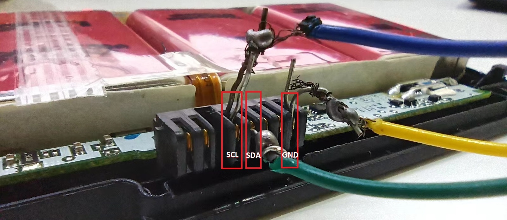
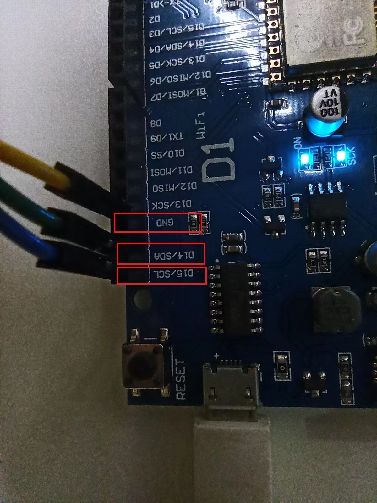

# SmartBastteryHack_ESP8266
This project is extended from SmartBatteryHack, Now, it works especially for WeMos D1 board that uses ESP8266 chip (ARM architecture).

# Development story
Initially, I've found the hacking project - SmartBatteryHack to decrypt the SBS(Smart Battery System) data, but it was reading /writing data based on AVR architecture (i.e, Ardunio Uno / Mega board), what I have only is the affordable board - WeMos D1 that uses ESP8266 chip at ARM architecture, so I decided to transform the base module for adapting ARM architecture.

# Usage
After you complied the main Ardunio interface - SmartBatteryHack.ino , then uploading it to WeMos D1 board, the data communication will be controlled by the original GUI program (see below) 

**Adapting new I2C read/write module**

Uses [SBS](https://github.com/simonchen/SBS) instead of SoftI2CMaster (see below)

# VSCODE development

# Lenovo batteries SDA/SCL pins
The pinout of lenovo batteries is always the same: || ||||| being: + + [gap] SCL SDA [unknown] GND GND

Reference link: (https://forum.thinkpads.com/viewtopic.php?t=77856)

**============[BELOW IS THE ORIGINAL README]===========**

# SmartBatteryHack
This is a hacking tool for smart batteries using SMBus. Originally written for a Dell J1KND battery that uses a [BQ8050](Datasheets/BQ8050_datasheet.pdf) fuel gauge IC.

**Arduino** folder contains the source code for an Uno/Mega which acts as an interface between the battery and an external computer. The I2C pins are connected to the smart battery's SDA/SCL pins with pullup resistors (4.7kOhm to 5V). The battery's ground pin has to be connected to the Uno/Mega's ground pin. Additionally the battery's "system present" pin may need to be grounded too (through a 100-1000 Ohm resistor). You need to install the [SoftI2CMaster](https://github.com/felias-fogg/SoftI2CMaster) library to be able to use this sketch.

**GUI** folder contains the C# source code and compiled binary for an external computer (Windows 7 and up) written in Visual Studio 2019.

Check the [Wiki](https://github.com/laszlodaniel/SmartBatteryHack/wiki) for tutorials.

More info about this project:  
https://boundarycondition.home.blog/2020/01/18/the-repairing-and-hacking-of-a-dell-j1knd-bq8050-laptop-battery/
